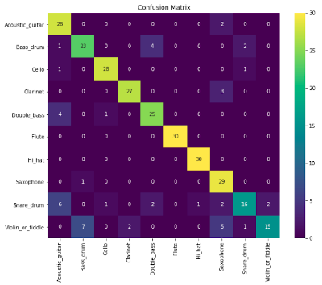

Pipeline for prototyping audio classification algorithms with TF 2.3


<!-- TOC -->

- [Environment](#environment)
- [Jupyter Notebooks](#jupyter-notebooks)
- [Audio Preprocessing](#audio-preprocessing)
- [Training](#training)
- [Plot History](#plot-history)
- [Confusion Matrix](#confusion-matrix)
- [Receiver Operating Characteristic](#receiver-operating-characteristic)

<!-- /TOC -->

### Environment

```
conda create -n audio python=3.7
activate audio
pip install -r requirements.txt
```

### Jupyter Notebooks

Assuming you have ipykernel installed from your conda environment

`ipython kernel install --user --name=audio`

`conda activate audio`

`jupyter-notebook`

### Audio Preprocessing

clean.py can be used to preview the signal envelope at a threshold to remove low magnitude data

When you uncomment split_wavs, a clean directory will be created with downsampled mono audio split by delta time

`python clean.py`


### Training

Change model_type to: conv1d, conv2d, lstm

Sample rate and delta time should be the same from clean.py

`python train.py`

### Plot History

Assuming you have ran all 3 models and saved the images into logs, check `notebooks/Plot History.ipynb`


`notebooks/Confusion Matrix and ROC.ipynb`

### Confusion Matrix



### Receiver Operating Characteristic


absl-py==0.9.0
astor==0.8.1
astunparse==1.6.3
audioread==2.1.8
backcall==0.1.0
cachetools==4.0.0
certifi==2019.11.28
cffi==1.14.0
chardet==3.0.4
cycler==0.10.0
decorator==4.4.2
gast==0.3.3
google-auth==1.11.3
google-auth-oauthlib==0.4.1
google-pasta==0.1.8
grpcio==1.27.2
h5py==2.10.0
idna==2.9
ipykernel==5.2.0
ipython==7.13.0
ipython-genutils==0.2.0
jedi==0.16.0
joblib==0.14.1
jupyter-client==6.1.0
jupyter-core==4.6.3
kapre==0.3.4
Keras-Applications==1.0.8
Keras-Preprocessing==1.1.2
kiwisolver==1.1.0
librosa==0.7.2
llvmlite==0.31.0
Markdown==3.2.1
matplotlib==3.1.3
numba==0.48.0
numpy==1.18.5
oauthlib==3.1.0
opt-einsum==3.2.0
pandas==1.0.1
parso==0.6.2
pexpect==4.8.0
pickleshare==0.7.5
Pillow==7.2.0
prompt-toolkit==3.0.4
protobuf==3.11.3
ptyprocess==0.6.0
pyasn1==0.4.8
pyasn1-modules==0.2.8
pycparser==2.19
Pygments==2.6.1
pyparsing==2.4.6
python-dateutil==2.8.1
python-speech-features==0.6
pytz==2019.3
PyYAML==5.3.1
pyzmq==19.0.0
requests==2.23.0
requests-oauthlib==1.3.0
resampy==0.2.2
rsa==4.0
scikit-learn==0.22.2
scipy==1.4.1
seaborn==0.10.1
six==1.14.0
SoundFile==0.10.3.post1
tensorboard==2.3.0
tensorboard-plugin-wit==1.7.0
tensorflow==2.3.1
tensorflow-estimator==2.3.0
termcolor==1.1.0
tornado==6.0.4
tqdm==4.43.0
traitlets==4.3.3
urllib3==1.25.8
wavio==0.0.4
wcwidth==0.1.8
Werkzeug==1.0.0
wrapt==1.12.0
